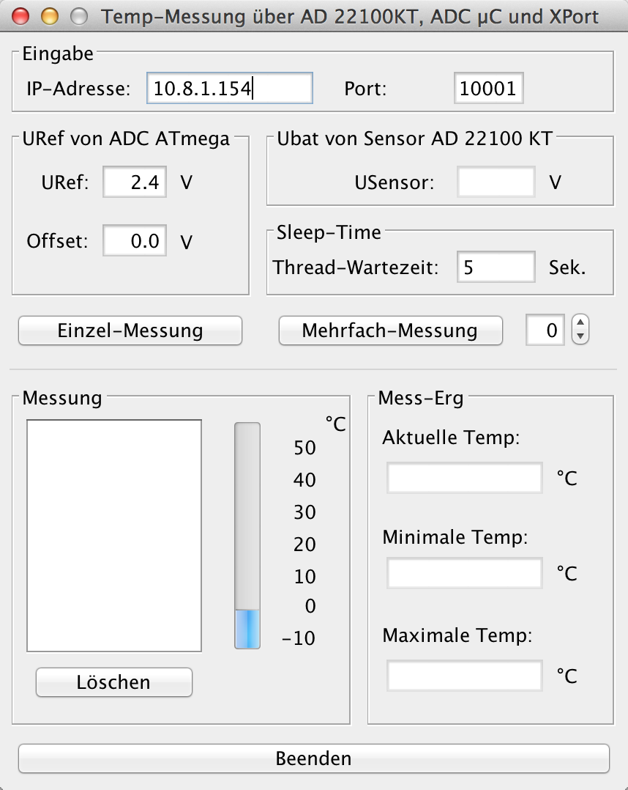
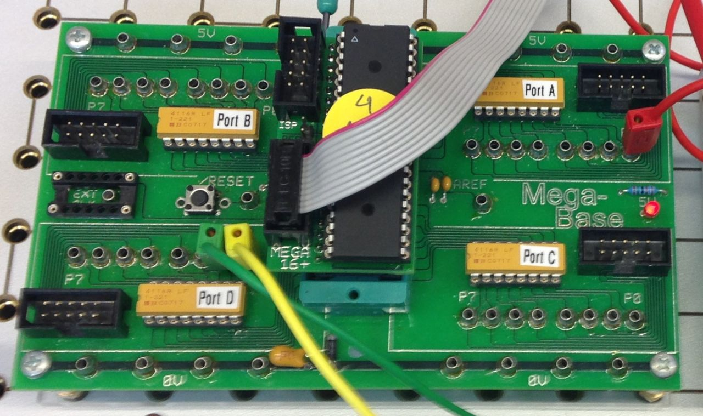
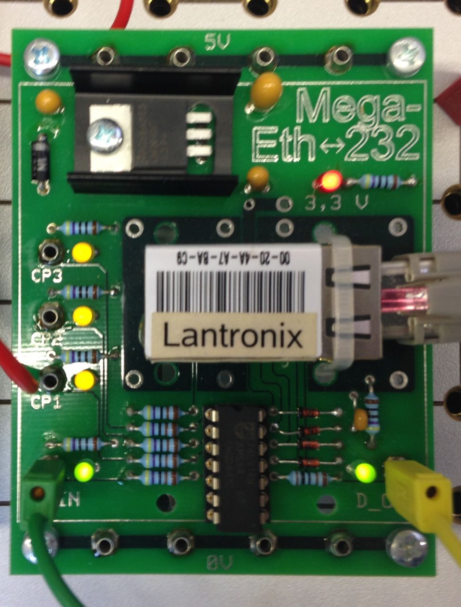
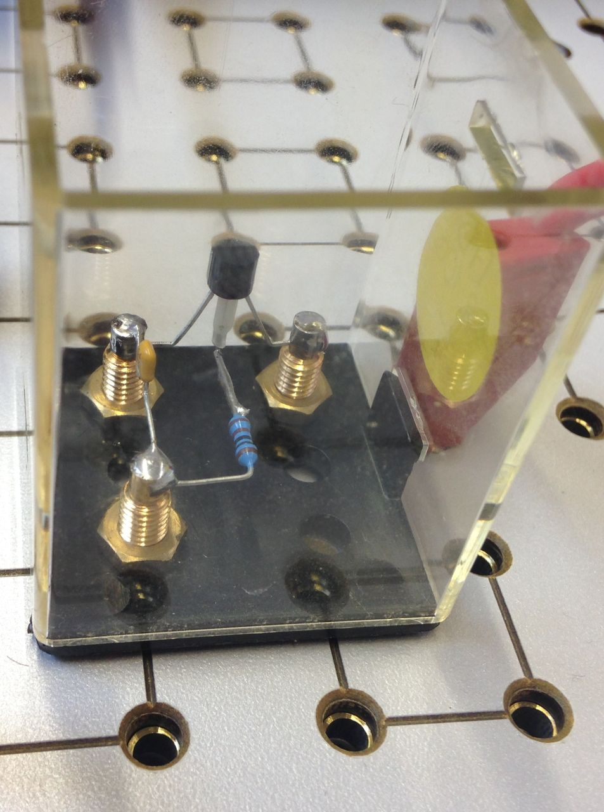

# Temperaturmessung über Ethernet

## Inhaltsverzeichnis
[Einleitung](#einleitung)  
[Projekt](#projekt)  
[Ist-Zustand](#ist-zustand)  
[Soll-Zustand](#soll-zustand)  
[Mikrokontroller](#mikrokontroller)  
[Aufbau](#aufbau)  
[Probleme](#probleme)  
[Defekter-µController](#defekter-µcontroller)  

---

## Einleitung
Im Auftrag des KTI-Unterrichts musste unsere Klasse FTI2 ein Projekt in mehreren Gruppen bearbeiten. Das Projekt sollte eine Temperaturmessung über das lokale Netzwerk ermöglichen. Dabei wird die Temperatur an einem Computer von einem Java Programm abgefragt.

## Projekt
Unsere Aufgaben beinhaltet, eine Entwicklung des C-Programms für den Controller, die Weiterentwicklung eines bestehenden Java Programms zur abfrage von der Temperatur sowie die Einstellungen für das Temperatur-Mess-System. Unter anderem musste eine Dokumentation am ende des Projekts erstellt werden.

## Ist-Zustand
* Hardware
 * ATmega16
 * MegaBase
 * Lantronix XPort (Ehternet to R232)
 * 1KΩ Wiederstand
 * Tmperatursensor (AD22100 KT - PTC)
* Beispiel-Programm in C für den Mikrokontroller
* Beispiel-Programm in Java für die Software

## Soll-Zustand
Das Java-Temperatur-Mess-Programm muss Einzel- und Mehrfachmessungen durchführen können. Die Mehrfachmessung kann auf eine bestimmte Anzahl von Messergebnissen (0-99) beschränkt werden.
Der entfernte Mikrokontroller soll über den Ethernet-Adapter(XPort) angesprochen werden. Somit müssen Eingabefelder für die Eingabe der IP-Adresse und dessen Ports vorhanden sein.
Folglich muss die Referenzspannung URef mithilfe der Oberfläche änderbar sein.
Die Messergebnisse sollen in einer Textliste ausgegeben werden. Zusätzlich soll das aktuelle Ergebnis in einer Grafik angezeigt werden. Mit einem Button „Löschen“ werden alle aktuellen Ergebnisse gelöscht.
Das minimalste-, maximalste- und aktuelle Messergebnis soll, nach der Messung, in einem separaten Textfeld angezeigt werden.
Der Button „Beenden“, beendet das Programm. 

## Mikrokontroller
Der µController muss auf "4MHz" gestellt werden, die Fuses auf "4MHz Clk mit 64ms StartUp" und der Optimierungsgraf auf "-00".
Das C-Programm des µControllers muss auf das Java-Programm abgestimmt werden. Es muss seine Messergebnisse in einem für Java verwertbaren Format übergeben können.

## Aufbau
Der Aufbau des Projekts findet in dem Schulischen Labor der IT-Schule Stuttgart statt. Hier wurden Vorgefertigte Platinen und ein Stecksystem genutzt.

# Probleme

## Inkompatible-Datentypen
Die vom µController gesendeten Daten werden in Java falsch empfangen. Dadurch werden im Ausgabefeld völlig sinnlose Zahlen ausgegeben. Gelöst wurde das Problem indem der Stream als Byte statt Char empfangen und weiterverarbeitet wird.
c-ausschnitt, java-ausschnitt

## Defekter-µController
Die Temperaturmessung funktioniert im Debugmodus problemlos, sobald das C-Programm normal läuft erscheinen zufällige, ein- bis sechsstellige Zahlen.
Nach vielen unterschiedlichen, fehlgeschlagenen Lösungsansätzen wurde der µController ausgetauscht.
